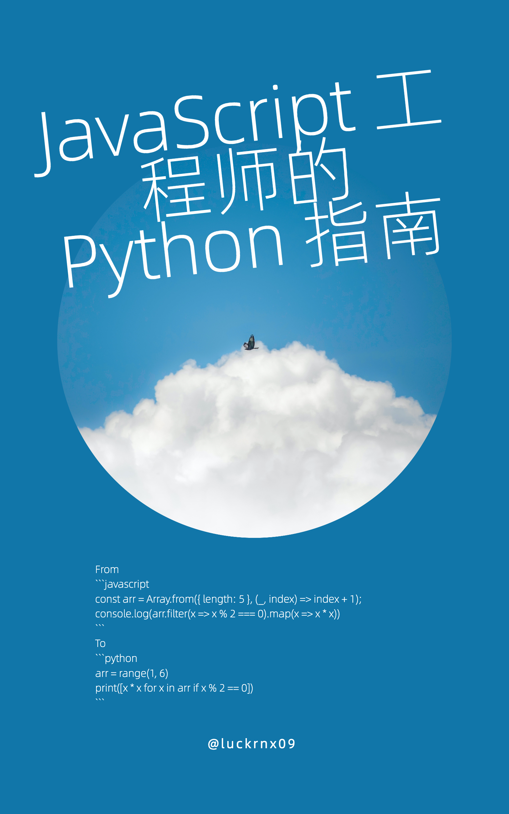

[English](./README.md) | 简体中文

# JavaScript инженерлеріне арналған Python нұсқаулығы

 

**«JavaScript инженерлеріне арналған Python нұсқаулығы»** — [abook](https://github.com/luckrnx09/abook) негізінде жазылған ашық бастапқы коды бар электронды кітап. Бұл кітапта Python ортасын орнатудан бастап жобаны әзірлеуге дейінгі барлық кезеңдер қамтылған. JavaScript пен Python тілдерінің айырмашылықтары мен ұқсастықтарын көптеген мысалдар арқылы салыстыра отырып түсіндіреді. Бұл JavaScript инженерлеріне Python тілін жылдам меңгеруге көмектеседі.

## Жергілікті оқу

Кітаптың EPUB форматындағы қытай тіліндегі нұсқасын жасағаны үшін [wizardforcel](https://github.com/wizardforcel) қауымдастығына алғыс білдіреміз. Сіз оны [осы жерден жүктей аласыз](https://github.com/luckrnx09/python-guide-for-javascript-engineers/files/14112960/JavaScript.Python.zip).

## Қатысушылар

Кітап мазмұнын толықтыру, түзету және аудару бойынша PR жіберуге қош келдіңіз!

## Лицензия

Қараңыз: [LICENSE](./LICENSE)
